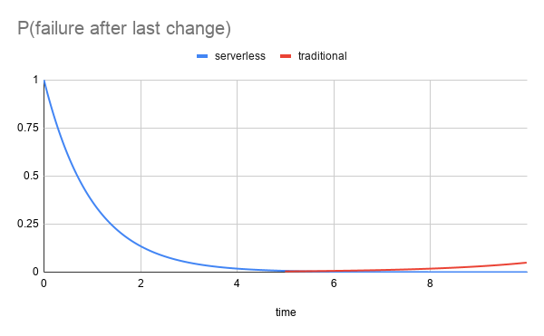

# The Serverless Stack

## What Is Serverless

A serverless app is a collection of managed services and some code that ties them all together. The value proposition of the serverless stack is threefold:

1. Write less code and ship faster.
2. Fully outsource the operation and security of your stack to your cloud provider.
3. Only pay for the resources that you use.

Serverless is often equated with function-as-a-service (eg. AWS Lambda), but this characterization misses the broader point about using managed services whenever possible. The functions are just the glue that provides missing integrations or features. Think of functions as a way to customize managed services, not as a way of building web services.

## Serverless Ops

Outsourcing operations is the most under-appreciated aspect of the serverless stack, as we are used to constantly anticipating failure modes of traditional services.

The probability of a failure after introducing a change decreases rapidly for both a traditional and a serverless architecture (blue line x < 5), but after a while, the probability of hitting a resource saturation type failure (red line) starts to increase for a traditional cloud stack. Auto-scaling strategies fail, databases run out of connections, networks get congested, and of course automatic recovery fails as well, and now your pager is buzzing at the most inconvenient of times. This is in contrast to how the probability of a failure after a change is monotonically decreasing with the serverless stack (blue line x > 5), because in a truly serverless architecture, resource saturation type failures are the responsibility of the cloud provider.

So by outsourcing the operation of your stack, not only does your operations workload decrease drastically, but you also get control over when to perform operational tasks. This means that you can operate your serverless stack at scale, securely and with high-availability, but without a 24/7 on-call rotation.

## What Is Not Serverless

This brings us to the question of how to differentiate between cloud services that are truly serverless or just branded serverless. Broadly speaking, a service is not serverless if handling resource exhaustion failures beyond hitting account limits are the user's responsibility. Warning signs are if the service has time-based instead of use-based billing, or if you need to do capacity planning, or come up with a scaling strategy before provisioning a service. (Capacity planning in serverless is cost optimization.) Another telltale sign is if the service exposes detailed system metrics like CPU load and RAM/disk space consumption. Truly serverless products will abstract these low level metrics away and expose high level metrics like number of requests and aggregate data throughput, or use a single system metric like memory as a proxy for all other metrics.

This means that most managed relational database services are not good choices for a serverless stack, because they are either vastly overprovisioned, or require careful capacity planning, which in turn prompts 24/7 monitoring to ensure high-availability, thus negating the core value propositions of the serverless stack.

## Lock-In

Vendor lock-in is a common problem for consumers of cloud services and this issue is only accentuated by the serverless stack. Since there is no way to avoid lock-in, my advice is to

1. Pick your serverless providers with care. (Read my reviews [here](providers/index.md).)
2. Once you pick a provider, embrace the lock-in, and don't slow yourself down with half-measures that give you an illusion of portability. 

## When to Use Serverless?

If you’re building a new web application today, your default choice should be the serverless stack. Once you gain proficiency with it, you will build applications faster and without having to worry about their operation.

## Reasons Not to Use Serverless

1. You have a lot of experience with a particular web stack and you want to prototype something quickly. Unless you want to learn serverless, just go with your favorite stack and deploy in whichever way you’re most comfortable let that be a VPS or Heroku.
1. You’re building a novel service that doesn’t have a managed equivalent. Don’t try to implement an in-memory database on top of Lambda, but make double sure that what you’re building can not be achieved by customizing and tying together existing managed services.

